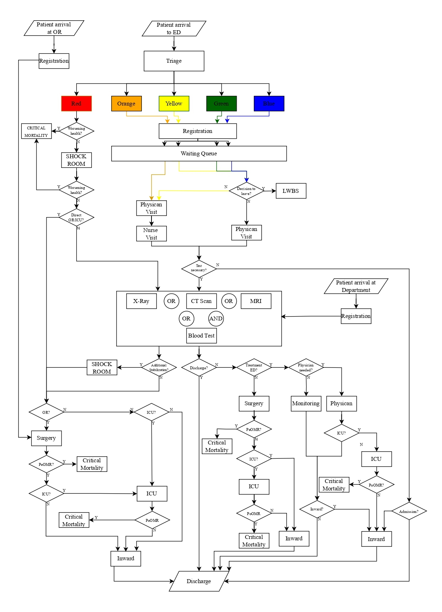

# 🏥 Hospital Cyberattack Simulation & Data Analysis (Master Thesis)

This repository contains all the components of my Master Thesis project, which models and analyzes the effects of a **ransomware attack** on a hospital using a **Discrete Event Simulation (DES)** approach in **AnyLogic**. The goal is to simulate operational disruptions and quantify their impact on hospital performance, supported by extensive **Monte Carlo simulations** and **Python-based data analysis**.

## 📁 Repository Structure
The repository is organized as follows:
- `Python/`: Contains the Python scripts and the plots used in my Master Thesis
- `Files/`: All results from the experiments
  - `Files/Datasets`: Contains all daily tracked KPIs throughout a simulation run
  - `Files/MainKPIs`: Contains the mean value of all tracked KPIs throughout a simulation run
  - `Files/Statistics`: Contains the statistical files throughout a simulation run

## 📌 Project Description

This project simulates a hospital environment exposed to a **ransomware attack** and measures its impact on hospital operations, such as:

- Patient flow
- Resource utilization
- Emergency room performance
- Queue times and delays

The simulation is run multiple times to capture the stochastic nature of hospital operations and cyberattacks. The results are analyzed to provide insights into how different attacks affect hospital performance and to suggest possible mitigation strategies.

### 📊 Flowchart of the Hospital Model

### 🔬 Experiments
The project contains the following experiments:
- Calibration Experiment
- Sensitivity Analysis
- One-Factor-at-a-Time (OFAT) Experiment for the analysis of the most critical hospital departments
- OFAT Experiment for the analysis of essential recovery parameters

## 🚀 Requirements

To run the simulation and analysis, you need the following dependencies:

- Python 3.8 or higher
- NumPy
- SciPy
- Pandas
- Matplotlib
- Jupyter Notebook
- AnyLogic (8.9.1) Free Version

## 🛠️ How to Use the AnyLogic Model

1. Download AnyLogic:

- Download and install AnyLogic (8.9.1) Free Version from the AnyLogic official website.

2. Open the Model:

- Open AnyLogic, and navigate to File > Open.
- Select the AnyLogic model file located in the repository (e.g., Files/AnyLogicModel/YourModelFile.alp).
Run the Simulation:

3. Open an Experiment

4. Start the simulation by clicking the "Run" button in AnyLogic.
- Configure the simulation parameters as needed. All parameters are adjustable, with important parameters being the recovery parameters and the arrival rates.
- If using the free version of AnyLogic, note the 50,000 agents per run limit. If this limit is exceeded, the simulation will break or stop and fail. Therefore, the simulation is limited to 50 days.
5. Export Simulation Results:
- The results of the simulation are exported at the end and saved in the following folders:
  - Files/Datasets: Contains all daily tracked KPIs throughout a simulation run.
  - Files/MainKPIs: Contains the mean value of all tracked KPIs throughout a simulation run.
  - Files/Statistics: Contains the statistical files throughout a simulation run.
- All results are saved as CSV files.

6. Control Ransomware Attack:

- You can turn on or off the ransomware attack by setting the StartRansomwareAttack parameter. Set it to -1 to turn off the ransomware attack.

## 📄 License

This project is licensed under the MIT License. See the LICENSE file for more details.
